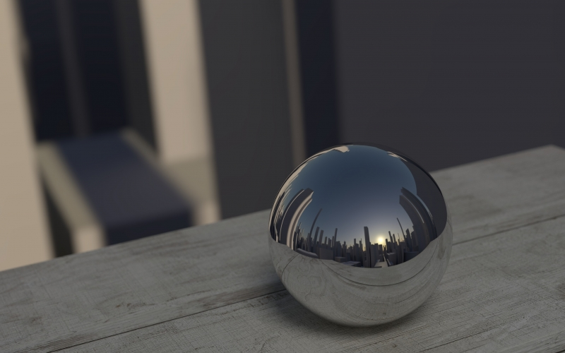
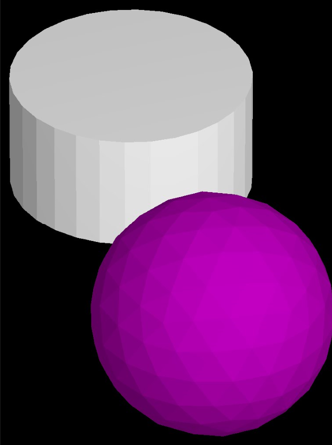

<h1 align="center">
   
  
   
  My3DEngine
   
</h1>

  <h3>implemented: </h3>
  <ul>

  <li>
    <a href="#2D-LSystems">2D LSystems</a>
      <ul>
      <li><a href="#Bracket-Rule">Bracket Rule</a></li>
      <li><a href="#Stochaic-Replacement">Stochaic Replacement Rule</a></li>
      </ul>
  </li>

  <li><a href="#3D-Linedrawings">3D Linedrawings</a></li>

  <li>
    <a href="#3D-Objects">3D Objects</a>
    <ul>
      <li><a href="#3D-LSystems">3D LSystems</a></li>
    </ul>
  </li>

  <li>
    <a href="#Zbuffering">ZBuffering</a>
    <ul>
    <li><a href="#ZBuffering-Lines">ZBuffering Lines</a></li>
    <li><a href="#ZBuffering-Triangles">ZBuffering Triangles</a></li>
    </ul>
  </li>

  <li>
    <a href="#3D-Fractals">3D Fractals</a>
    <ul>
    <li><a href="#BuckyBall">BuckyBall</a></li>
    <li><a href="#Mengersponge">Mengersponge</a></li>
    </ul>
  </li>

  <li>
    <a href="#Lighting">Lighting</a>
    <ul>
    <li><a href="#Ambient-Light">Ambient Light</a></li>
    <li><a href="#Diffuse-Light">Diffuse Light</a></li>
    <ul>
    <li><a href="#Infinity-Light">Infinity Light</a></li>
    <li><a href="#Point-Light">Point Light</a></li>
    </ul>
    <li><a href="#Specular-Light">Specular Light</a></li>
    </ul>
  </li>

  <li><a href="#Shadowing">Shadowing</a></li>

  </ul>

<h1 id="2D-LSystems">2D LSystems</h1>

  

<h1 id="Bracket-Rule">Bracket-Rule</h1>

<h1 id="Stochaic-Replacement">Stochaic Replacement Rule</h1>

<ul>
  <li>Put %x behind a rule
    <ul>
    <li>x is a double with "." as decimal point (always type a decimal point)</li>
    </ul>
  </li>
  <li>If you don't use %x, then the probability of this rule is automatically 100%</li>
  <li>The percentages get added in order</li>
  <li>
    What if the sum is under 100:
    <ul>
    <li>The resting percentage get filled with a "do not replace" rule</li>
    <li>Eg: Rules: F -> "F+F" %50, G->"F-(F+F)" | Now there is a 50% chance F->"F"</li>
    </ul>
  </li>
  <li>
    What if the sum is above 100:
    <ul>
    <li>This wil not cause an error, it will only result in unexpected outcomes</li>
    <li>Eg: Rules: F -> "F+F" %70, F->"F-F" %50 | The chance for "F-F" is actually 30% not 50%</li>
    <li>Eg: Rules: F -> "F+F" %10, F->"F-F"   | The chance fo "F-F" is actually 90%</li>
    <li>Eg: Rules: F-> "F+F", F->"F-F" %70 | The chance for "F-F" is actually 0% not 70%</li>
    </ul>
  </li>
</ul>

<h1 id="3D-Linedrawings">3D Linedrawings</h1>

<h1 id="3D-Objects">3D Objects</h1>

<h3>Implemented Objects:</h3>
<ul>
  <li><b>Object3D::Object3DFactory::createLineDrawing(const ini::Section &objsec);</b></li>
  <li><b>Object3D::Object3DFactory::createTetrahedron();</b></li>
  <li><b>Object3D::Object3DFactory::createCube();</b></li>
  <li><b>Object3D::Object3DFactory::createIcosahedron();</b></li>
  <li><b>Object3D::Object3DFactory::createDodecahedron();</b></li>
  <li><b>Object3D::Object3DFactory::createOctahedron();</b></li>
  <li><b>Object3D::Object3DFactory::createCylinder(const int &n, const double &h);</b></li>
  <li><b>Object3D::Object3DFactory::createCone(const int &n, const double &h);</b></li>
  <li><b>Object3D::Object3DFactory::createSphere(const int &n);</b></li>
  <li><b>Object3D::Object3DFactory::createTorus(const double &r, const double &R, const int &n, const int &m);</b></li>
  <li><b>Object3D::Object3DFactory::loadObj(const std::string &filename);</b></li>
  <ul>
  <li>Loads in an object from any .obj file compatible with the obj Parser <b>(examples provided in exampleFiles Folder)</b></li>
  </ul>
</ul> 

<h1 id="3D-LSystems">3D LSystems</h1>

<h1 id="Zbuffering">Zbuffering</h1>

<h1 id="ZBuffering-Lines">ZBuffering Lines</h1>

<h1 id="ZBuffering-Triangles">ZBuffering Triangles</h1>

<h1 id="3D-Fractals">3D Fractals</h1>

<h3>Implemented Fractal Objects:</h3>
<ul>
  <li><b>Object3D::Object3DFactory::createFractalCube(const double &fractalScale, const int &nrIterations);</b></li>
  <li><b>Object3D::Object3DFactory::createFractalDodecahedron(const double &fractalScale, const int &nrIterations);</b></li>
  <li><b>Object3D::Object3DFactory::createFractalIcosahedron(const double &fractalScale, const int &nrIterations);</b></li>
  <li><b>Object3D::Object3DFactory::createFractalOctahedron(const double &fractalScale, const int &nrIterations);</b></li>
  <li><b>Object3D::Object3DFactory::createFractalTetrahedron(const double &fractalScale, const int &nrIterations);</b></li>
</ul>

<h1 id="BuckyBall">BuckyBall</h1>

<ul>
    <li><b>Object3D::Object3DFactory::createBuckyBall();</b></li>
    <li><b>Object3D::Object3DFactory::createFractalBuckyBall(const double &fractalScale, const int &nrIterations);</b></li>
</ul>

<h1 id="Mengersponge">Mengersponge</h1>

    

<ul>
    <li><b>Object3D::Object3DFactory::createMenger(const int &nrIterations);</b></li>
</ul>

<h1 id="Lighting">Lighting</h1>

    

<h1 id="Ambient-Light">Ambient Light</h1>

    

<h1 id="Diffuse-Light">Diffuse Light</h1>

    

<h1 id="Infinity-Light">Infinity Light</h1>

This light only has a pointing direction.

    

<h1 id="Point-Light">Point Light</h1>

This light onlyl has a location.

It could be a spotlight, if the spotangle != -1.

    

<h3>SpotLight</h3>

    

<h1 id="Specular-Light">Specular Light</h1>

    
    

<h1 id="Shadowing">Shadowing</h1>

    
    

## License
MIT

---

> GitHub [@ArneDePeuter](https://github.com/ArneDePeuter) &nbsp;&middot;&nbsp;
> Mail [arne.depeuter@uantwerpen.be]()

