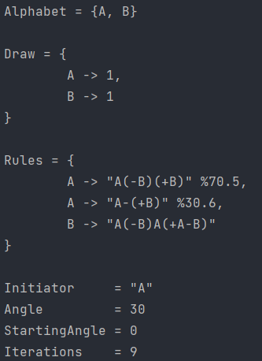

<h1 align="center">
   
  
   
  My3DEngine
   
</h1>

  <a href="#2D LSystems">2D LSystems</a> •

## 2D LSystems
___

<h1 align="center">

</h1>

  <a href="#() rule LSystems">() rule LSystems</a> •
  <a href="#Stochaic 2D LSystems">Stochaic 2D LSystems</a>

## () rule LSystems
___

<h1 align="center">

</h1>

## Stochaic 2D LSystems
  - Put %x behind a rule
    - x is a double with "." as decimal point (always type a decimal point)
  - If you don't use %x, then the percentage of this rule is 100% automatically
  - The percentages get added inorder
  - What if the sum is under 100?
    - The resting percentage get filled with a "do not replace" rule
      - Eg: Rules: F -> "F+F" %50, G->"F-(F+F)" | Now there is a 50% chance F->"F"
  - What if the sum is above 100?
    - This wil not cause an error internally, it will only result in weird outcomes
      - Eg: Rules: F -> "F+F" %70, F->"F-F" %50 | The chance for "F-F" is actually 30% not 50%
      - Eg: Rules: F -> "F+F" %10, F->"F-F"   | The chance fo "F-F" is actually 90%
      - Eg: Rules: F-> "F+F", F->"F-F" %70 | The chance for "F-F" is actually 0% not 70%

<h1 align="center">

</h1>
<h1 align="center">

</h1>

## 3D Lines

## License

MIT

---

> GitHub [@ArneDePeuter](https://github.com/ArneDePeuter) &nbsp;&middot;&nbsp;
> Mail [arne.depeuter@uantwerpen.be]()

